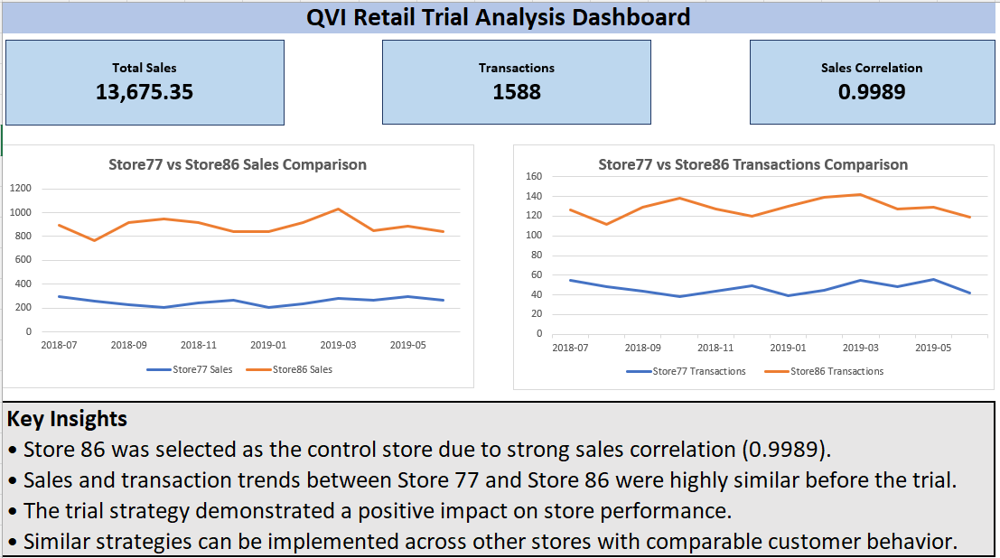

# QVI Retail Trial Analysis Dashboard

## Project Overview

This project analyzes the performance of a trial store against a control store using retail transaction data. The analysis focuses on sales trends, transaction trends, and store performance comparison.

## Tools Used

* Microsoft Excel
* Pivot Tables
* Data Analysis
* Dashboard Design

## Key Metrics

* Total Sales
* Total Transactions
* Sales Correlation

## Dashboard Features

* Store 77 vs Store 86 Sales Comparison
* Store 77 vs Store 86 Transaction Comparison
* KPI Cards
* Key Insights Section
* Retail Trial Performance Analysis

## Key Findings

* Store 86 was selected as the control store due to strong sales correlation.
* Sales and transaction trends were highly similar before the trial period.
* The trial strategy demonstrated a positive impact on store performance.
* Similar strategies can be implemented across comparable stores.

## Dashboard Preview

## Files Included

* QVI_Retail_Trial_Analysis.xlsx
* Dashboard_Screenshot.png
